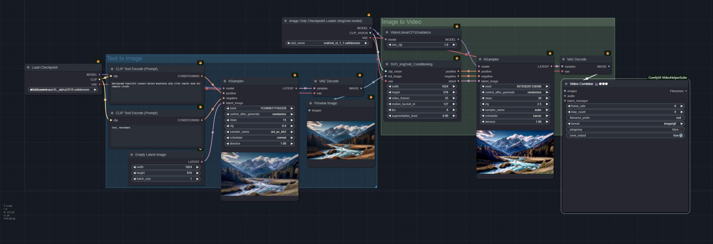
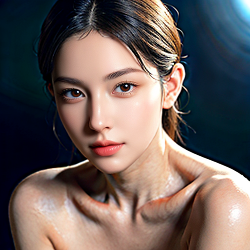

# comfyui_workflow

- 基础工作流
- 工具
- 高级工作流

### 基础工作流

- sd15 basic, 官方示例
  
- sdxl basic 1
  
- sdxl basic 2
  
- svd basic
  
  
  <!-- <video width="320" height="240" controls>
    <source src="resource/basic/svd_00001.mp4" type="video/mp4">
  </video> -->
<!-- - sd cascade
   -->
- sd3 medium
  

### 工具
- reactor, 换脸简单示例
   
- dwpose 关键点检测
- depth map 深度图获取
- yolo 检测相关
  - yolo face detect
  - yolo face seg
  - yolo worlds
  - yolo hands detect
- 图像超分，简单调用
- 

### 高级工作流
<!-- - 0001_img_face_detailar
  - 人脸修复，使用 facedetailer 进行重采样
  
  

- 0002_video_get_mask
  - 使用 segment everything 进行 codef 的数据预处理，生成对应的 mask 和图片帧并保存在指定文件夹，注意需要指定保存的根路径，使用了一些字符串拼接操作
  - https://qiuyu96.github.io/CoDeF/
  - 

- 0003_img_controlNet_basic_img2img_with_lineart_add_faceswap
  - 使用 lineart 进行图片控制，并进行人脸修复和 faceswap
  - 
  - 

- 0003_img_detect_and_crop_with_mask
  - 获取人体框的 mask 和 截取对应的人体

- 0004_img_ipadapter_style_fusion
  - 使用 ipadapter 融合不同风格的图片
  - 注意不同 ipadpater 的控制程度不同，并非越强越好
  - 

- 0005_img_ipadapter_combine2img_by_mask
  - ipadapter 使用 mask 技术将两个人物组合在一起，注意 ipadapter需要更强的控制力度，选择 plus 版本，可以使用不同风格的 base模型生成不同风格的图片
  - 
  - 
  - 

- 0006_img_ipadapter_combine3img_by_mask_with_bg
  - ipadpater 使用 mask 进行构图，将人物和背景风格图片融合
  - 
  - 
  - 
  - 

- 0007_img_basic_comfyui_with_clip_conditional
  - 对 conditional 三种方式 concat,average,combine 的不同理解，详见[https://www.youtube.com/watch?v=_C7kR2TFIX0&t=1026s],很优秀的介绍视频
  - 

- 0008_img_face_detect_and_crop_and_pose
  - 人体 pose 和人脸框检测
  - 
- 0008_img_face_detect_and_crop
  - 人脸关键点检测
  -  -->
