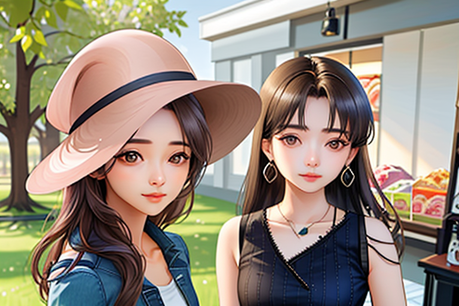

# comfyui_workflows

- 基础工作流
- 工具
- 高级工作流
- comfyui 插件说明

tips: can be directly dragged into comfyui

### 基础工作流

- sd15 basic, 官方示例
  
- sdxl basic 1
  
- sdxl basic 2
  
- svd basic
  
  
  <!-- <video width="320" height="240" controls>
    <source src="resource/basic/svd_00001.mp4" type="video/mp4">
  </video> -->
<!-- - sd cascade
   -->
- sd3 medium
  

### 工具
- reactor, 换脸简单示例
   
- dwpose keypoints detect
   
- depth map
- yolo 
  - yolo face detect
    
  - yolo face seg [model ref from](https://huggingface.co/jags/yolov8_model_segmentation-set/tree/main)，选择不同的模型得到不同区域，适用于人脸，人体等
    
  - yolo worlds
  - yolo hands detect
- super resolution
  - basic sr model with img
    
- face landmarks seg
- clothes seg
- background remove
  - BRIA 1.4（could deal with video）
  

### 高级工作流
- 接入sd3 medium 的中文版肖像大师，ref from [zho-zho-zho](https://github.com/ZHO-ZHO-ZHO/ComfyUI-Workflows-ZHO)
  
- style align 风格一致性生成 [style align](https://github.com/brianfitzgerald/style_aligned_comfy)  [教学](https://www.youtube.com/watch?v=itBiBOYWHF8)
  - 在一个batch内, 可以生成朝向一致且风格一致的结果
  
- 人脸修复 适用 facedetailer 模块进行重采样，注意此处会修复过大，失真可能严重，谨慎使用
  - 模型生成的人脸
    
  - 输入人脸
    
- ipadapter 多元素组合，全图作用
  
- ipadapter faceid, sd15 模型, 注意 prompt 不能过于复杂
  
- ipadapter 使用 mask 对图片进行换衣，需要使用 inpaint 模型
  

### comfyui 插件说明

- https://github.com/ltdrdata/ComfyUI-Impact-Pack
- https://github.com/WASasquatch/was-node-suite-comfyui
- https://github.com/rgthree/rgthree-comfy
- https://github.com/pythongosssss/ComfyUI-Custom-Scripts

<!-- 
- 0002_video_get_mask
  - 使用 segment everything 进行 codef 的数据预处理，生成对应的 mask 和图片帧并保存在指定文件夹，注意需要指定保存的根路径，使用了一些字符串拼接操作
  - https://qiuyu96.github.io/CoDeF/
  - 

- 0003_img_controlNet_basic_img2img_with_lineart_add_faceswap
  - 使用 lineart 进行图片控制，并进行人脸修复和 faceswap
  - 
  - 

- 0003_img_detect_and_crop_with_mask
  - 获取人体框的 mask 和 截取对应的人体

- 0004_img_ipadapter_style_fusion
  - 使用 ipadapter 融合不同风格的图片
  - 注意不同 ipadpater 的控制程度不同，并非越强越好
  - 

- 0005_img_ipadapter_combine2img_by_mask
  - ipadapter 使用 mask 技术将两个人物组合在一起，注意 ipadapter需要更强的控制力度，选择 plus 版本，可以使用不同风格的 base模型生成不同风格的图片
  - 
  - 
  - 

- 0006_img_ipadapter_combine3img_by_mask_with_bg
  - ipadpater 使用 mask 进行构图，将人物和背景风格图片融合
  - 
  - 
  - 
  - 

- 0007_img_basic_comfyui_with_clip_conditional
  - 对 conditional 三种方式 concat,average,combine 的不同理解，详见[https://www.youtube.com/watch?v=_C7kR2TFIX0&t=1026s],很优秀的介绍视频
  - 

- 0008_img_face_detect_and_crop_and_pose
  - 人体 pose 和人脸框检测
  - 
- 0008_img_face_detect_and_crop
  - 人脸关键点检测
  -  -->
